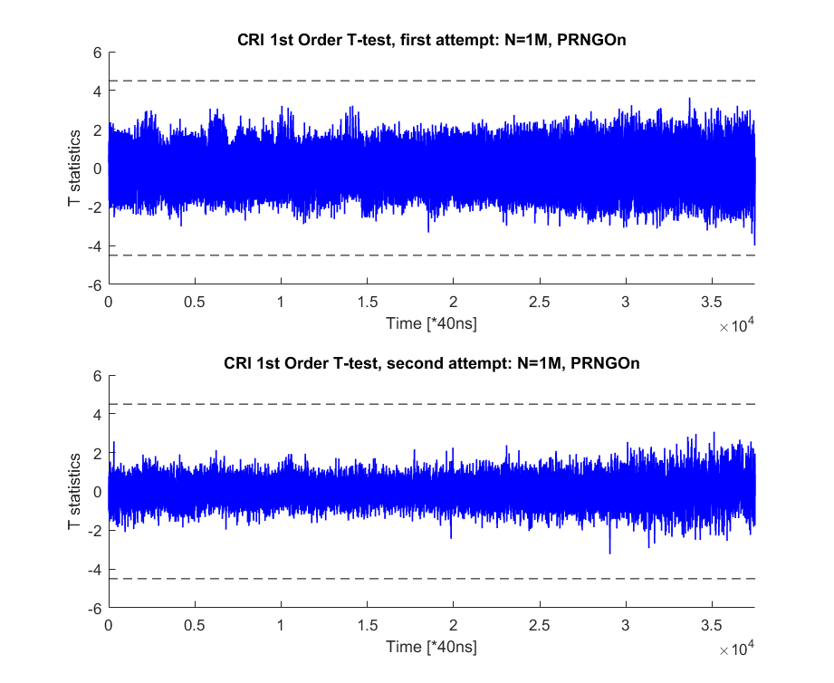

# A Thumb Assembly based Byte-wise Masked AES implementation 
The skeleton of this implementation comes from one of Dr. David McCann's [test example for ELMO](https://github.com/bristol-sca/ELMO/tree/master/Examples/FixedvsRandom/MaskedAES_R1). The original version was written in Thumb assembly (GNU syntax), covering only the first round encryption. For various reasons, I have extended it to a full 10-round masked implementation.

Unlike other implementations, the purpose of this implementation is to test what kind of leakage a Cortex M0 core could create in practice. This means not only this masked implementation has been tested by TVLA on a realistic M0 core, but also all assembly code has been customized to avoid any unexpected leakage. In other words, this is a "security-first" implementation: you might notice that although it is written in assembly, the encryption latency is not significantly better than [other C-based implementations](https://github.com/gs1989/Masked-AES-Implementation/tree/master/Byte-Masked-AES). 

Note that this implementation is actually customized for a specific M0 core (NXP LPC 1114). Although many cores may have the same leakage behavior, there is no way to claim security for any core that has not been tested. Users may have to verify on their target platforms that whether the "patches" here are effective (or not).    

## Thumb-based Masked AES
### Scheme
The byte-wise implementation follows a well-known textbook example scheme. As said before, several security "patches" have been added to make it 1st order secure on that specific M0 core. Details can be found in the [scheme introduction](Scheme_Introduction.md).

### Security Evaluation
We have performed 1st order standard CRI TVLA test with 1 million traces on an NXP LPC1114 \(Cortex M0\) core. 

 

Note that according to [the CRI's standard](https://csrc.nist.gov/csrc/media/events/non-invasive-attack-testing-workshop/documents/08_goodwill.pdf), only the same leakage samples show up in both attempts as "leaky" with the same polarity will be counted as leakage.

Corresponding experiment setups can be found in [Setup.md](TVLA-Test/Setup.md) .

Attention: although this one does not show 1st order leakage, this is BY NO MEANS secure by itself! 1st order protection will not defeat 2nd order attack, which is indeed quite easy here.

